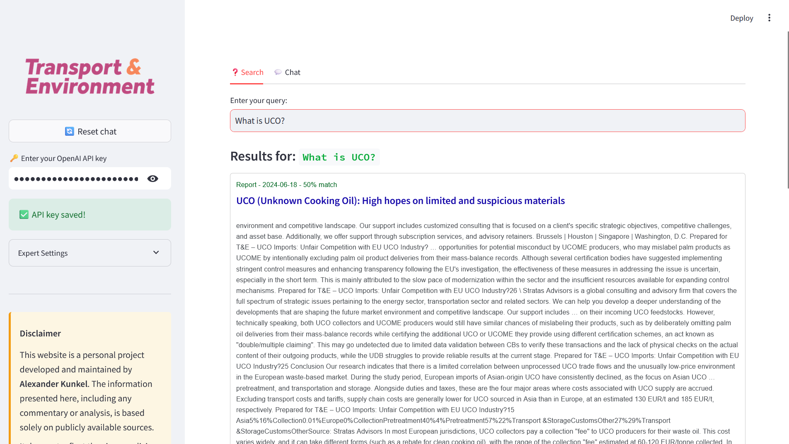
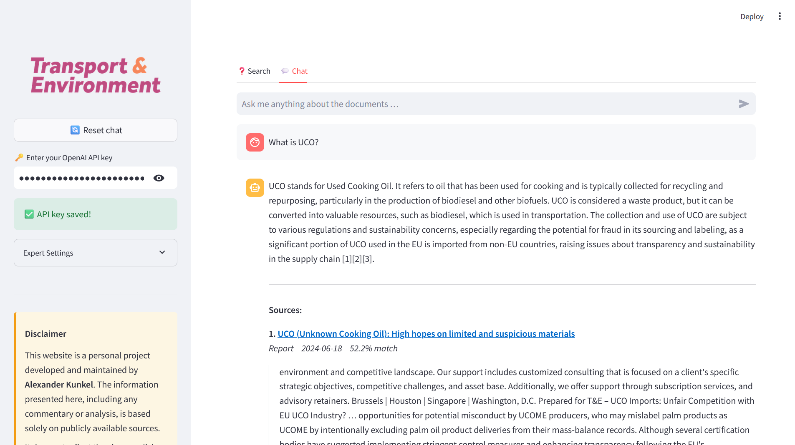

# Internal Knowledge Database

This project is designed to scrape, process, and search through a collection of publications, providing a user-friendly internal knowledge database. The application integrates a FAISS-powered search index, and a Streamlit frontend for a modern and efficient user experience.


## Features

- **Embedding Generation**: Use state-of-the-art models to create vector embeddings for semantic search.
- **FAISS Indexing**: Efficient retrieval of relevant documents using FAISS.
- **Streamlit Frontend**: A clean, interactive UI for searching publications, complete with clickable results.
- **Persistent Storage**: Save scraped data, embeddings, and metadata for reuse.

## Project Structure

```plaintext
project_name/
│
├── scraping/               # Tools for web scraping
│   ├── fetch_html.py       # Script to fetch and save HTML
│   ├── scrape_publications.py  # Main scraping logic
│   └── utils.py            # Helper functions (e.g., logging, sanitization)
│
├── data/                   # Storage for raw and processed data
│   ├── publications/       # PDF files or other raw data
│   ├── fetched_html/       # HTML files saved during scraping
│   ├── faiss_index/        # Stored FAISS index
│   └── metadata.json       # Metadata file for documents
│
├── data/             # Code for embedding generation and FAISS indexing
│   ├── generate_embeddings.py   # Script to generate embeddings
│   ├── faiss_index_utils.py     # Functions to save/load FAISS index
│   └── model_utils.py      # Wrapper for embedding model (e.g., SentenceTransformer)
│
├── frontend/               # Streamlit or other frontend code
│   ├── app.py              # Main Streamlit application
│   ├── templates/          # Optional, for custom HTML templates
│   ├── static/             # Images, CSS, or JS files for the frontend
│   └── assets/             # Company logos or branding materials
│
├── requirements.txt        # Python dependencies
├── README.md               # Project documentation
├── .gitignore              # Files to ignore in version control
└── config.py               # Centralized configuration settings
```

## Installation
### Prerequisites

- Python 3.8 or later
- Pip (Python package manager)

## Setup

### Clone the repository:

- `git clone https://github.com/your-repo/internal-knowledge-database.git`
- `cd internal-knowledge-database`

### Set up a virtual environment (optional but recommended):

- `python -m venv venv`
- `source venv/bin/activate  # On Windows: venv\Scripts\activate`

### Install dependencies:

- `pip install -r requirements.txt`

### Configure the application:

- Update `config.py` with relevant paths and settings.

### Run the Streamlit frontend:

- `streamlit run frontend/app.py`

## Usage

### Generate Embeddings:
- Run the `generate_embeddings.py` script to create embeddings and build a FAISS index.
- Update embedding model, chunk size, etc. in `config.py`

### Search Through Publications:
- Access the Streamlit app and enter a query in the search bar to retrieve results.



### Chat with Publications:
- Access the Streamlit app and enter a query in the chat bar to have a chat with them.



## Configuration

- The application is configured via the `config.py` file. Update the paths and model names as needed.

## Tests

- Test application by running test scripts in test folder using `python -m pytest -v .\tests\PLACEHOLDER.py`

## Future Enhancements

- Add support for hybrid search (semantic + keyword-based).
- Improve the frontend with advanced filtering options.
- Automate periodic updates for new publications.

## License

- This project is licensed under the MIT License. See the LICENSE file for details.